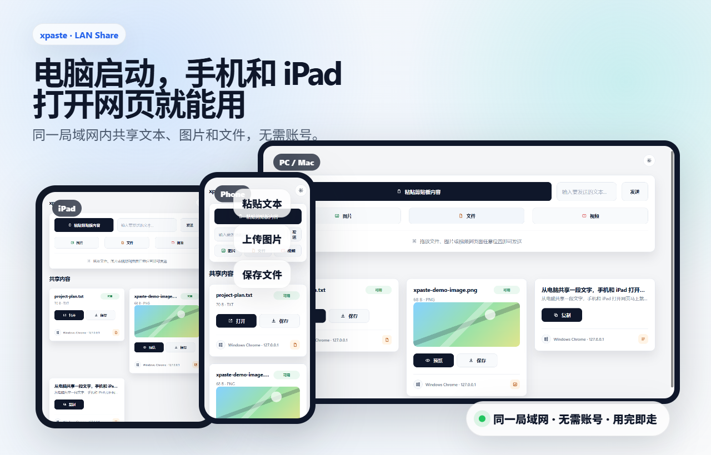
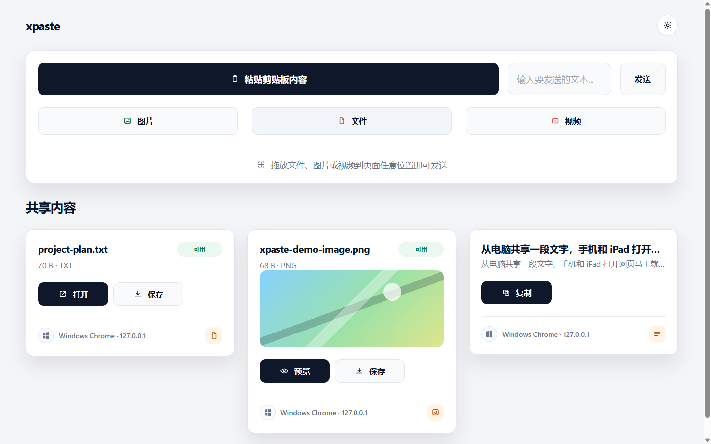
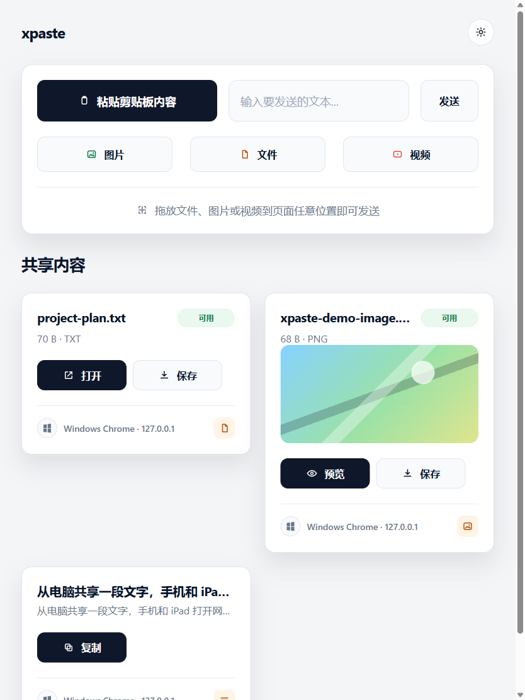
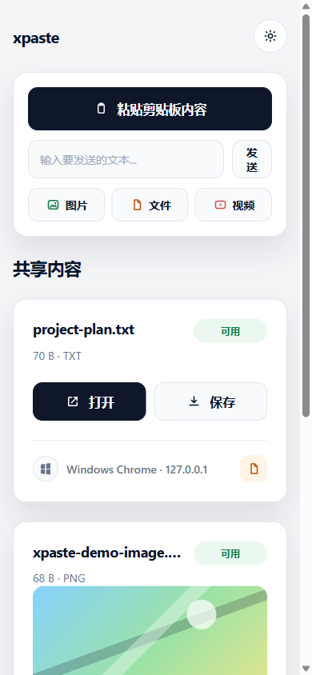

# xpaste 发布介绍稿

## 微信公众号长文版

# 我做了一个“用完即走”的局域网跨设备共享工具：xpaste



> 演示视频：[电脑、iPad、手机跨设备共享演示](../../media/demo/xpaste-multidevice-demo.webm)

你有没有遇到过这种小麻烦：

手机里有一张截图，想发到电脑上；电脑里有一段文字，想复制到手机；Mac 上下载了一个文件，想临时传给 Windows；iPad 上看到一段内容，想放到另一台设备继续处理。

很多时候，我们只是想临时传一下东西，却不得不打开聊天软件、登录账号、扫码确认、建群、发给自己，或者在不同系统之间来回折腾。

所以我做了一个很轻量的小工具：**xpaste**。

它的目标很简单：在同一个局域网里，让所有能打开网页的设备，都可以方便地共享剪切板、文本、图片、视频和文件。

上图就是实际使用时的状态：电脑启动服务后，手机和 iPad 不需要安装客户端，打开同一个局域网地址即可共享内容。

## 它怎么用？

在一台已经安装 Node.js 的电脑上执行：

```sh
npm install -g xpaste-server
xpaste
```

终端会显示本机地址和局域网地址。手机、平板、另一台电脑只要打开这个地址，就能直接使用。

更方便的方式是先在电脑的 Chrome 中打开终端显示的局域网地址，然后使用 Chrome 自带的二维码功能：

1. 点击地址栏右侧的分享图标；如果当前版本未显示该图标，也可以在页面空白处点击右键。
2. 选择“创建此页面的二维码”或“为此页面创建二维码”。
3. 用手机或平板自带的相机扫描二维码。
4. 点击相机识别出的链接，直接在移动设备浏览器中打开 xpaste。

这样不需要在手机上手动输入 IP 地址，也不需要安装扫码 App。只要移动设备与电脑处于同一局域网，并且能够访问该电脑，扫码后就能进入同一个共享页面。



不需要注册账号。

不需要安装手机 App。

不需要登录云服务。

不需要配置数据库。

用的时候启动，不用的时候 `Ctrl+C` 关闭，所有临时内容都会随服务结束而不可访问。

## 为什么它适合“临时共享”？

xpaste 的使用方式更接近一个临时工作台。

你在电脑上启动服务，其他设备通过浏览器进入同一个页面。页面里会实时显示当前可获取的内容：文本、图片、视频、文件等。

典型使用流程就是：电脑运行 `xpaste`，Chrome 打开局域网地址并生成二维码，手机或 iPad 用相机扫码进入，然后开始发送和获取内容。

如果你想从电脑发一段文字到手机，直接在网页里粘贴或输入并发送。

如果你想把手机里的图片传到电脑，打开网页后选择图片上传。

如果你在 PC 或 Mac 上，甚至可以直接拖拽文件到页面里。

所有设备看到的是同一个实时列表。谁发了内容，其他设备马上就能看到、复制、预览或保存。



在平板上，输入、上传和内容卡片会根据屏幕宽度自动排列，不需要切换到另一个专用版本。

## 跨平台：只要有浏览器就能用

xpaste 本质上是一个纯 Web 应用。

服务端运行在一台电脑上，客户端就是浏览器页面。因此它天然适配多种设备：

- Windows
- macOS
- Linux
- iPhone
- iPad
- Android 手机
- Android 平板
- 其他能访问网页的设备

这也是我设计它时最看重的一点：不要把用户绑到某个系统或某个客户端里。

只要设备能访问运行 xpaste 的那台电脑，就能加入共享。



手机端保留了最核心的粘贴、上传、复制和保存操作，页面空间优先留给共享内容。

## 不需要账号，也不走云端

xpaste 面向的是局域网内的临时共享场景。

它不要求账号体系，不依赖第三方云同步，也不会要求你把文件上传到某个外部服务。

当前版本的设备在线状态和近期内容元信息都保存在服务进程内存里，图片、视频、文件等二进制内容使用操作系统临时目录。关闭服务后，这些运行时内容就不可继续访问。

这让它很适合这些场景：

- 家里几台设备之间临时互传截图、文件、链接
- 办公室同一网络下，手机和电脑之间传资料
- 不想登录聊天软件，只想快速发一段文字给另一台设备
- 临时把 iPad、Mac、Windows、Android 设备串在一起工作
- 演示、调试、测试时快速搬运数据

## 使用体验：打开网页就能开始

xpaste 的界面重点不是“设备管理”，而是“我现在能拿到什么内容”。

页面中最重要的是共享内容列表。每一条内容都是一个 DataItem：可能是一段文本、一张图片、一个视频或一个普通文件。

文本可以直接复制。

图片和视频可以预览或保存。

文件可以打开或下载。

非即时内容会显示可用状态；如果对应设备下线或内容已被清理，页面也会弱化这类不可用内容。

移动端、平板、桌面端都有响应式适配，也支持跟随系统的浅色/深色模式。

如果想先看完整流程，可以直接播放这段真实页面录屏：

[播放 xpaste 使用演示](../../media/demo/xpaste-demo.webm)

## 它不是网盘，也不是聊天软件

xpaste 不想替代网盘，也不想替代聊天工具。

它解决的是一个更小、更高频的问题：

**我现在有一段内容，要立刻给局域网里的另一台设备用。**

它不强调长期存储，不强调联系人关系，不强调复杂权限。

它强调的是：

- 开箱即用
- 用完即走
- 跨设备
- 跨系统
- 不需要账号
- 局域网内直接共享

## 安全提醒

当前版本没有账号和鉴权机制。

这意味着：只要某台设备能访问 xpaste 服务端口，就可以看到和发布共享内容。

所以请只在可信的家庭、办公室或个人热点网络中使用。首次启动时，如果系统防火墙询问是否允许访问，也请确认当前网络环境后再放行。

## 适合谁？

如果你经常在多台设备之间来回切换，尤其是手机、平板、PC、Mac 混用，xpaste 会很顺手。

它不是一个庞大的系统，而是一个小工具。

启动它，打开网页，把内容扔进去，另一台设备拿走。

就这么简单。

项目地址：

```text
https://github.com/dqjk/xpaste
```

安装：

```sh
npm install -g xpaste-server
xpaste
```

## 小红书版


我做了一个局域网跨设备共享小工具：xpaste。

它适合这种场景：手机截图想传电脑、电脑文字想发到手机、Mac 文件想给 Windows、iPad 内容想临时丢到另一台设备。

使用方式很简单：

```sh
npm install -g xpaste-server
xpaste
```

然后用手机/平板/其他电脑打开终端里显示的局域网地址。

不想手动输入地址也很简单：在电脑 Chrome 中打开 xpaste，使用浏览器自带的“为此页面创建二维码”，手机或 iPad 用系统相机一扫，点击链接即可进入。

特点：

- 不用注册账号
- 不用装手机 App
- 不用建群发给自己
- 同一局域网内直接共享
- Windows、Mac、Linux、iPhone、iPad、Android 都能用
- 支持文本、剪切板、图片、视频、文件
- 用完直接关掉服务

它不是网盘，也不是聊天软件，更像是一个临时共享工作台。

启动后，所有设备都通过浏览器进入同一个页面。你上传的内容会实时出现在列表里，其他设备可以复制、预览或保存。

适合多设备工作流，也适合临时传文件、传截图、传一段文字。

项目地址：`https://github.com/dqjk/xpaste`

建议配图顺序：

1. [电脑、iPad、手机同屏封面](../../media/demo/xpaste-multidevice-cover.png)
2. [桌面端实际界面](../../media/demo/multidevice/desktop.png)
3. [iPad 端实际界面](../../media/demo/multidevice/ipad.png)
4. [手机端实际界面](../../media/demo/multidevice/phone.png)

视频：[跨设备真实使用演示](../../media/demo/xpaste-multidevice-demo.webm)

## 微博版


做了一个小工具 xpaste：同一局域网内跨设备共享剪切板、文本、图片、视频和文件。

一台电脑运行：

```sh
npm install -g xpaste-server
xpaste
```

其他手机、平板、电脑直接用浏览器打开局域网地址即可。

电脑端 Chrome 还可以直接为当前页面创建二维码，手机或 iPad 用自带相机扫码就能打开，不需要手输 IP，也不需要额外扫码 App。

无需账号、无需手机 App、无需云端同步。Windows / macOS / Linux / iPhone / iPad / Android 都能用。适合临时传截图、文件、文本，用完 `Ctrl+C` 关闭服务。

项目地址：`https://github.com/dqjk/xpaste`

配套视频：[xpaste 跨设备真实使用演示](../../media/demo/xpaste-multidevice-demo.webm)

## 发布素材与顺序

1. 首图使用 [跨设备总览封面](../../media/demo/xpaste-multidevice-cover.png)，让读者第一眼看到电脑、iPad、手机同时使用。
2. 正文依次使用 [桌面端](../../media/demo/multidevice/desktop.png)、[iPad 端](../../media/demo/multidevice/ipad.png)、[手机端](../../media/demo/multidevice/phone.png) 的真实截图。
3. 主视频使用 [跨设备演示视频](../../media/demo/xpaste-multidevice-demo.webm)，重点表达“电脑启动，Chrome 生成当前页面二维码，移动设备用相机扫码即可使用”。
4. 备用视频使用 [单设备功能演示](../../media/demo/xpaste-demo.webm)，展示粘贴、上传与 DataItem 卡片。
5. 微信公众号后台不保留本地 Markdown 视频链接，发布时应将 WebM 转为平台接受的视频格式后上传，并把视频插入到“它怎么用？”段落之后。
6. 小红书建议发布一条视频笔记，同时将四张图片作为图文笔记备选；微博建议使用总览封面加跨设备视频。

视频下一版建议补充一段清晰操作：电脑 Chrome 打开局域网地址，调用“为此页面创建二维码”，随后切到手机相机扫码并打开页面。二维码必须来自局域网地址，不能使用仅电脑自身可访问的 `localhost` 或 `127.0.0.1` 地址。
